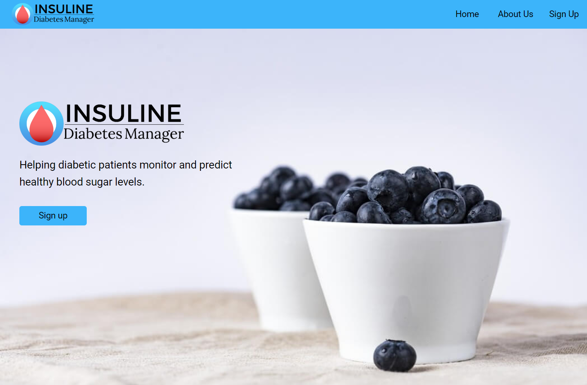

You can see part of my portfolio below. Clicking the logos will bring you to their github page.

Visit [my GitHub](https://github.com/gyhou/) for more source code.

<table id="repo-table">
<tbody>
<tr>
    <td id="NCAAB">

      
      
<i class="fa fa-star"></i><b>NCAAB</b>

      
    
</td>
    <td id="yelp_dataset">

      
      
<i class="fa fa-star"></i><b>yelp_dataset</b>

      
    
</td>
</tr>
<tr>
    <td id="yelp_dataset">

      
      
<i class="fa fa-star"></i><b>yelp_dataset</b>

      
    
</td>
    <td id="yelp_dataset">

      
      
<i class="fa fa-star"></i><b>yelp_dataset</b>

      
    
</td>
</tr>
<tr>
    <td id="yelp_dataset">

      
      
<i class="fa fa-star"></i><b>yelp_dataset</b>

      
    
</td>
    <td id="diabetes-manager">

      
      
<a class="repo-description" href="https://github.com/Build-Week-Diabetes-Manager">Help diabetic patients track and predict blood glucose levels!</a>

    
</td>
</tr>
<tr>
    <td id="CHSI-Dash">

      
      
<i class="fa fa-star"></i><b>CHSI-Dash</b>

      
    
</td>
    <td id="tennis">

      
      
<i class="fa fa-star"></i><b>tennis</b>

      
    
</td>
</tr>
</tbody>
</table>
